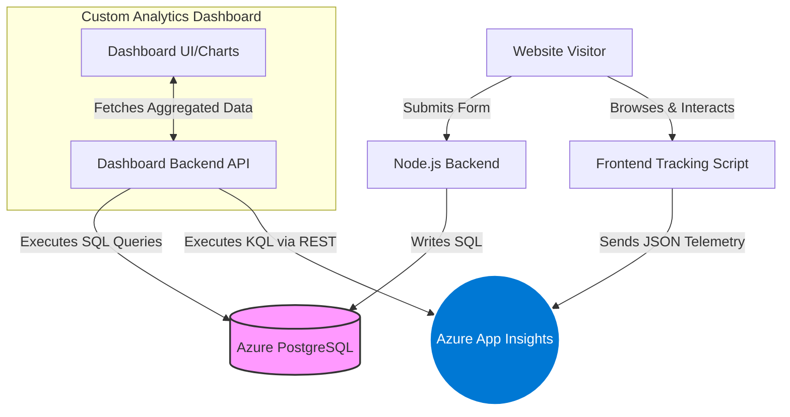

# EchoMail Production Guide

## 🔐 Security & Safety Protocol
This application is secured using Microsoft Identity and role-based access.

*   **Authorized Senders:** 
    *   `aakash.padyachi@orchvate.com`
    *   `rahul.rajesh@orchvate.com`
*   **Safety Blast Password:** `ECHO12345`
    *   *Note: This password is required in the custom popup before any newsletter blast can be initiated.*
*   **Session Memory:** Authentication status is cached in `sessionStorage` for fast page transitions. Clearing your browser cache or logging out will reset this.

---

# Orchvate Analytics Dashboard: Engineering Blueprint

This document serves as the master engineering blueprint for building the **Orchvate Analytics Dashboard**. It details the complete architecture, data schemas, and query logic required to unify both **Frontend Behavioral Telemetry** and **Backend Database Records** into a single, cohesive visualization platform.

---

> [!CAUTION]
> **CONFIDENTIAL CREDENTIALS BELOW**
> This section contains live production credentials. Do not commit this document to a public repository without removing or obscuring the passwords and keys.

## 1. Environment Credentials (CONFIDENTIAL)

To build the dashboard, your backend application will need to authenticate with both Azure resources using the following credentials.

### Azure PostgreSQL Database
Connect your SQL client or backend ORM using these details:
*   **Host:** `generative-ai.postgres.database.azure.com`
*   **Port:** `5432` (Default PostgreSQL)
*   **Database Name:** `newsletter_db`
*   **Username:** `orchvate_admin`
*   **Password:** `Coffee!92`
*   **SSL Configuration:** Required (`sslmode=require` or DB_SSL="true")

### Azure Application Insights (Telemetry)
Use this key to authorize the JavaScript tracker, and use the Azure Portal to generate a REST API key for your dashboard backend.
*   **Instrumentation Key:** `6f8ab2d0-e0c7-4ea2-8169-5edf9242551f`
*   **Ingestion Endpoint:** `https://eastus-8.in.applicationinsights.azure.com/`
*   **Region:** East US

---

## 2. System Architecture & Data Flow

The dashboard aggregates data from two distinct streams:
1.  **Azure PostgreSQL:** The source of truth for hard conversions (verified subscribers, inquiries).
2.  **Azure Application Insights:** The source of truth for user behavior (scrolls, clicks, active time, performance).



---

## 3. Backend Database Intelligence (PostgreSQL)

The PostgreSQL database tracks absolute business conversions. The dashboard should query this directly to visualize growth and pipeline health.

### Database Schemas

#### Table: `subscribers` (Newsletter Double-Opt-In)
| Column Name | Data Type | Description |
| :--- | :--- | :--- |
| `id` | Integer (PK) | Unique identifier |
| `name` | Text | Subscriber's name (optional) |
| `email` | Text (Unique) | Subscriber's email address |
| `token` | Text | Secure token sent via Azure Communication Services |
| `is_verified` | Boolean | `TRUE` if the user clicked the email link |
| `created_at` | Timestamp | When the form was initially submitted |
| `verified_at` | Timestamp | When the email link was successfully clicked |

#### Table: `inquiries` (Conversation Starters)
| Column Name | Data Type | Description |
| :--- | :--- | :--- |
| `id` | Integer (PK) | Unique identifier |
| `name` / `email` | Text | Contact details |
| `topic` | Text | The subject they wish to discuss |
| `message` | Text | The body of their inquiry |
| `newsletter_opt_in`| Boolean | `TRUE` if they checked the subscribe box |
| `source` | Text | Where the form was located (e.g., 'Website') |

### SQL Visualization Queries

Use these SQL queries to power the conversion widgets on the dashboard.

> [!TIP]
> **Performance:** For large datasets, ensure `verified_at` and `is_verified` are indexed in PostgreSQL to keep dashboard load times under 100ms.

````carousel
```sql
-- WIDGET 1: Newsletter Verification Funnel (Funnel Chart)
SELECT 
    COUNT(*) AS total_signups,
    SUM(CASE WHEN is_verified = TRUE THEN 1 ELSE 0 END) AS verified_subscribers,
    SUM(CASE WHEN is_verified = FALSE THEN 1 ELSE 0 END) AS pending_subscribers
FROM subscribers;
```
<!-- slide -->
```sql
-- WIDGET 2: Subscriber Growth Over Time (Line Chart)
SELECT 
    DATE_TRUNC('month', verified_at) AS signup_month,
    COUNT(id) AS new_verified_subscribers
FROM subscribers
WHERE is_verified = TRUE
GROUP BY signup_month
ORDER BY signup_month ASC;
```
<!-- slide -->
```sql
-- WIDGET 3: Top Inquiry Topics (Donut Chart)
SELECT 
    topic, 
    COUNT(*) as total_inquiries
FROM inquiries
WHERE topic IS NOT NULL AND topic != ''
GROUP BY topic
ORDER BY total_inquiries DESC;
```
<!-- slide -->
```sql
-- WIDGET 4: Cross-Pollination Rate (Gauge/KPI)
SELECT 
    COUNT(*) AS total_inquiries,
    (SUM(CASE WHEN newsletter_opt_in = TRUE THEN 1.0 ELSE 0.0 END) / COUNT(*)) * 100 AS opt_in_percentage
FROM inquiries;
```
````

---

## 4. Frontend Behavioral Telemetry (App Insights)

Application Insights provides the "why" behind the conversions by tracking exactly how users interact with the site.

### Telemetry Event Dictionary

| Event Name | Trigger | Key Custom Dimensions Captured |
| :--- | :--- | :--- |
| **`FormSubmitted`** | Form submission | `formName`, `pageUrl` |
| **`LinkClicked`** | `<a>` tag click | `linkText`, `linkHref`, `isExternal` |
| **`ScrollDepth`** | 25/50/75/100% scroll | `depth`, `pageUrl` |
| **`PageLoadMetrics`**| Page fully loaded | `pageLoadTime`, `domContentLoaded` |
| **`Exception`** | JS Error / Promise fail | `source`, `lineno`, `problemId` |
| **`DeviceMetrics`** | Initial page load | `isMobile`, `screenWidth`, `prefersDarkMode` |
| **`TimeOnPage`** | Page unload | `activeTimeSeconds` (excludes background tabs) |
| **`MediaPlayed`** | Video/Audio play | `mediaSrc`, `mediaType` |
| **`ApiLatency`** | `/api/` fetch resolves | `apiUrl`, `durationMs` |

### App Insights API Integration

Your dashboard backend must authenticate with the **Azure Application Insights REST API**.

> [!WARNING]
> **Security Requirement:** Never expose the App Insights REST API Key in the browser. The dashboard's Node.js/C# backend must make these requests and proxy the data to the frontend.

**Endpoint:** `https://api.applicationinsights.io/v1/apps/{app-id}/query`
**Headers Required:** `x-api-key: YOUR_AZURE_REST_API_KEY`

### KQL Visualization Queries

Use these Kusto Query Language (KQL) scripts to extract behavioral insights.

````carousel
```kusto
// WIDGET 5: Mobile vs Desktop Split (Pie Chart)
customEvents
| where name == "DeviceMetrics"
| extend isMobile = tostring(customDimensions.isMobile)
| summarize Count = count() by isMobile
```
<!-- slide -->
```kusto
// WIDGET 6: Active Reading Time (KPI Number)
customEvents
| where name == "TimeOnPage"
| extend ActiveSeconds = toint(customDimensions.activeTimeSeconds)
| extend PageUrl = tostring(customDimensions.pageUrl)
| summarize AverageTimeSeconds = avg(ActiveSeconds) by PageUrl
```
<!-- slide -->
```kusto
// WIDGET 7: Page Scroll Drop-off (Funnel Chart)
customEvents
| where name == "ScrollDepth"
| extend Depth = tostring(customDimensions.depth)
| extend PageUrl = tostring(customDimensions.pageUrl)
| summarize ReachedCount = count() by Depth, PageUrl
| order by PageUrl, Depth asc
```
<!-- slide -->
```kusto
// WIDGET 8: Backend API Latency (Time Series Line Chart)
customEvents
| where name == "ApiLatency"
| extend DurationMs = toint(customDimensions.durationMs)
| extend ApiUrl = tostring(customDimensions.apiUrl)
| summarize AverageWaitTimeMs = avg(DurationMs) by bin(timestamp, 1h), ApiUrl
| render timechart
```
````

---

## 5. Recommended Dashboard Layout

To maximize the impact of this data, we recommend structuring the Custom Dashboard UI into three distinct tiers:

1.  **Tier 1: High-Level KPIs (Top Row)**
    *   Total Verified Subscribers (SQL)
    *   Cross-Pollination Opt-in % (SQL)
    *   Average Active Time on Page (KQL)
    *   Mobile Traffic % (KQL)
2.  **Tier 2: Conversion & Health Trends (Middle Row)**
    *   Subscriber Growth Line Chart (SQL)
    *   Newsletter Funnel Chart [Pending -> Verified] (SQL)
    *   API Latency Health Timeline (KQL)
3.  **Tier 3: Content Engagement (Bottom Row)**
    *   Top Inquiry Topics Donut Chart (SQL)
    *   Scroll Depth Drop-off Funnel (KQL)
    *   Live Feed of JS Exceptions (KQL)
